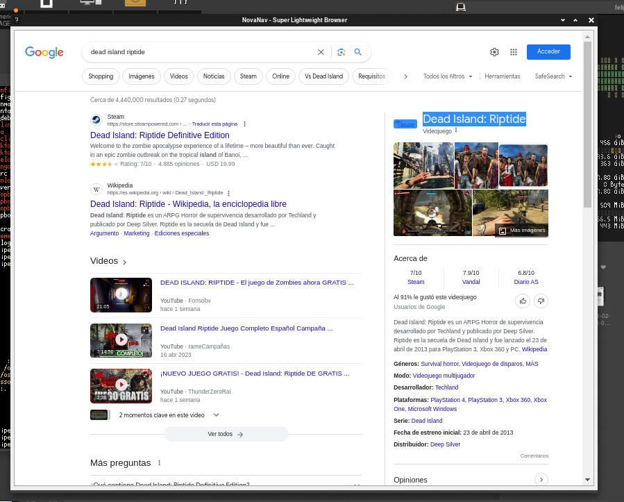
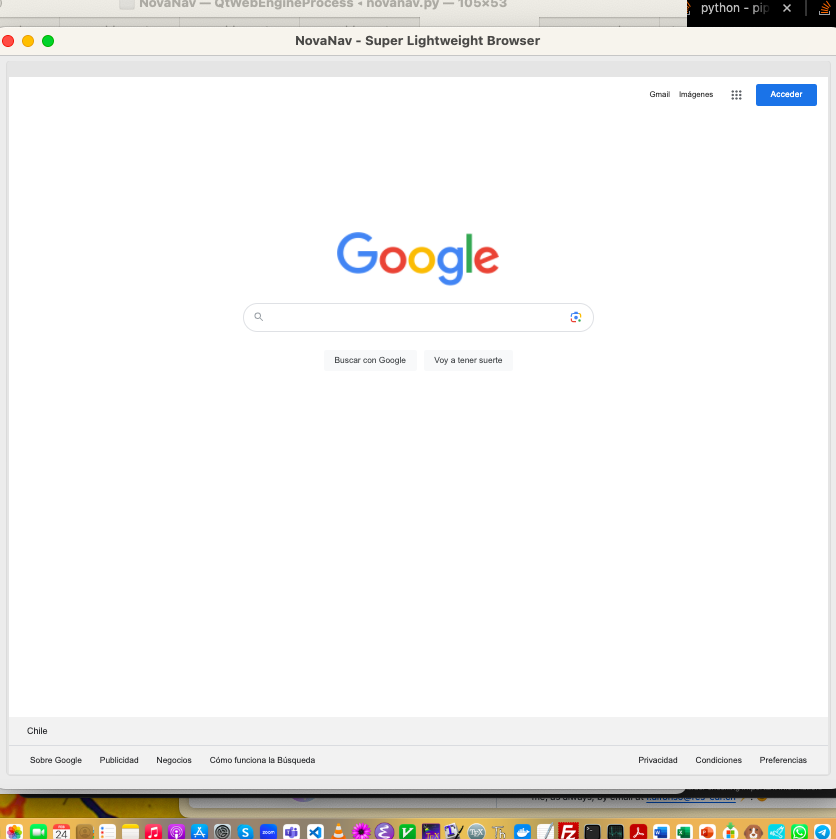

### 🌐 NovaNav - Super Lightweight Browser

NovaNav: Lightweight browser* for Linux and macOS, delivering fast, distraction-free browsing experience. This is my own version for Arc Browser mostly for Linux.

NovaNav, inspired by Arc Browser, is a minimalist and distraction-free web browser developed using PyQt5 and QtWebEngineWidgets. It offers essential browsing functionalities while focusing on simplicity and efficiency. With NovaNav, users can effortlessly navigate the web, open multiple tabs, and adjust zoom settings for optimal viewing.
The browser's clean interface and intuitive design make it ideal for users who prefer a clutter-free browsing experience. By minimizing distractions and prioritizing essential features, NovaNav aims to provide a seamless and enjoyable web browsing experience.

 

<sub>* This is currently an experimental phase where the primary focus is on making the system functional and establishing a practical and logical pathway that aligns with both my vision and the project's goals. It might contain errors, bugs, etc. Many other non-core elements of the project are considered secondary.</sub>ub>


[](https://github.com/Naereen/badges/)


[](https://opensource.org/licenses/BSD-3-Clause)

<!--
[](http://perso.crans.org/besson/LICENSE.html)
-->

[](https://www.vim.org/)
[](https://code.visualstudio.com/)


#### Current Features
#### 🚀 Current Features (Some might be in progress)

- Tab Management: Open multiple tabs and switch between them seamlessly.
- URL Navigation: Enter URLs directly or use the search bar to navigate to websites.
- Zoom Control: Adjust zoom settings to customize the display of web pages.
- User-friendly Interface: Clean and intuitive interface for easy navigation and usage.
- Basic Settings: Customize settings such as homepage and default search engine.


#### Screenshots

[](#)

#### Screenshot Linux

<p align="center">
  
</p>

#### Screenshot macOS

<p align="center">
  
</p>


#### Future Goals
#### 🚀 Future Goals

- Implement support for bookmarks to allow users to save their favorite websites for quick access.
- Enhance tab management features, such as rearranging tabs and grouping them into tab sets.
- Improve compatibility with various web standards and technologies to ensure a seamless browsing experience.
- Introduce customization options for user interface themes and keyboard shortcuts to cater to different user preferences.
- Enhance privacy and security features to protect user data and browsing activities from unauthorized access.


#### Requirements

Install Python3, then:

You might need perhaps to create an enviroment for pip: 
```
python3 -m venv novanav-env
source novanav-env/bin/activate
```

If not, just go with this:

```
pip3 install -r requirements.txt
```

Runt it with: 

```
python3 ./src/novanav.py
```

#### How-to - NovaNav

```
ctrl+t (New tab)
ctrl+v (hide tabs for distraction-free)
ctrl+q (quit)
```

#### 🤝 Support and Contributions

If you find this project helpful and would like to support its development, there are several ways you can contribute:

- **Code Contributions**: If you're a developer, you can contribute by submitting pull requests with bug fixes, new features, or improvements. Feel free to fork the project and create your own branch to work on.
- **Bug Reports and Feedback**: If you encounter any issues or have suggestions for improvement, please open an issue on the project's GitHub repository. Your feedback is valuable in making the project better.
- **Documentation**: Improving the documentation is always appreciated. If you find any gaps or have suggestions to enhance the project's documentation, please let me know.

[](https://www.buymeacoffee.com/felipealfonsog)
[](https://www.paypal.me/felipealfonsog)
[](https://github.com/sponsors/felipealfonsog)

Your support and contributions are greatly appreciated! Thank you for your help in making this project better. If you need to mail me, this is the way: f.alfonso@res-ear.ch (I'm Felipe, the Computer Science Engineer behind this idea. Cheers!)

#### 📄 License

This project is licensed under the [BSD 3-Clause License](LICENSE). It will have some restrictions, ask about it.
