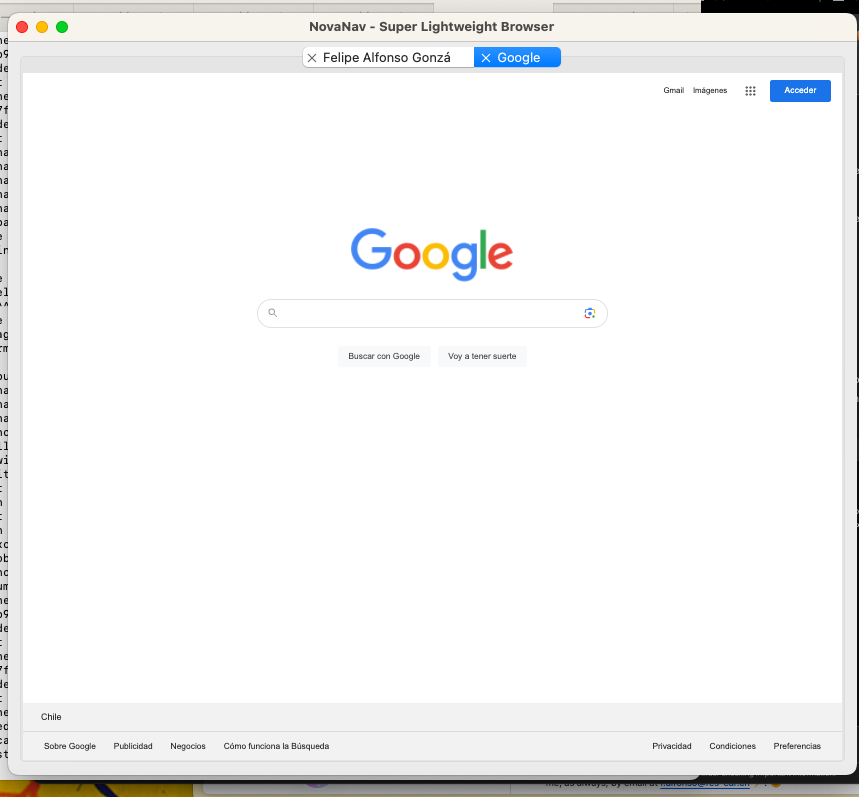

### NovaNav
NovaNav: Lightweight browser for Linux and macOS, delivering fast, distraction-free browsing experience.

#### Screenshots

<p align="center">
  
</p>

<p align="center">
  
</p>

#### Requirements

```
pip install -r requirements.txt
```

```
python3 -m venv novanav-env
source novanav-env/bin/activate
```

#### Runt it

```
python ./src/novanav.py
```
