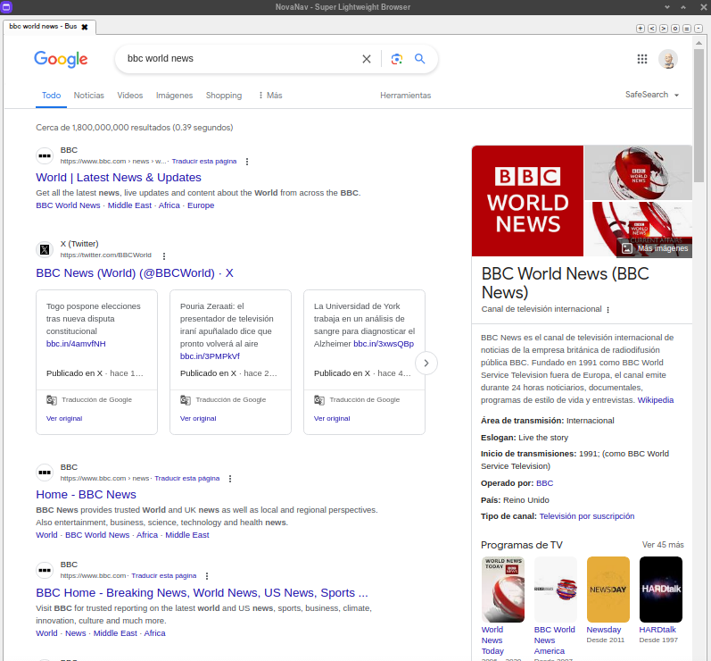
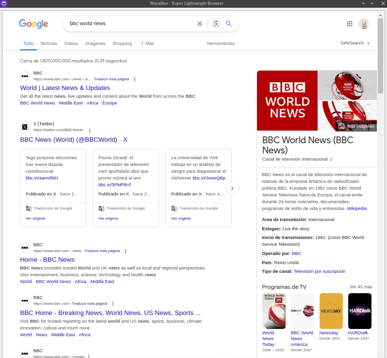

#### NovaNav - Super Lightweight Browser 🌐 

 

NovaNav: Lightweight browser delivering a fast, distraction-free browsing experience for Linux (AUR package available & Bash installer for Arch & Debian), working smoothly. During the Bash installation, you can choose macOS, but it is not stable yet. It offers essential browsing functionalities while focusing on simplicity and efficiency, to mainly be focused in browsing, just that. It's a a minimalist and distraction-free web browser. It's designed to be simple and efficient, with essential browsing functionalities while prioritizing simplicity and efficiency. With NovaNav, users can effortlessly navigate the web, open multiple tabs, and adjust zoom settings for optimal viewing using the keyboard. The browser's clean interface and intuitive design make it ideal for users who prefer a clutter-free browsing experience. By minimizing distractions and prioritizing essential features, NovaNav aims to provide a seamless and enjoyable web browsing experience.


[](https://github.com/felipealfonsog/NovaNav#installation)

<!--
[](https://github.com/felipealfonsog/NovaNav#installation)
-->

<sub>* This is currently an experimental phase where the primary focus is on making the system functional and establishing a practical and logical pathway that aligns with both my vision and the project's goals. It might contain errors, bugs, etc. Many other non-core elements of the project are considered secondary.</sub>


[](https://github.com/Naereen/badges/)


[](https://opensource.org/licenses/BSD-3-Clause)

<!--
[](http://perso.crans.org/besson/LICENSE.html)
-->

[](https://www.vim.org)
[](https://code.visualstudio.com/)


#

#### Screenshots

[](#)

#### Screenshot Linux

<p align="center">
  
</p>

<p align="center">
  
</p>

<!-- 
#### Screenshot macOS

<p align="center">
  
</p>

-->

#

#### Packages needed:

If you're using Arch Linux, you can find NovaNav Browser in your program menu after installation!

  - qt5-base
  - qt5-webengine
  - python3 


#

#### Installation
#### Via AUR using YAY 

[](https://aur.archlinux.org/packages/novanav)

<!-- 
[](https://aur.archlinux.org/packages/novanav)
-->

https://aur.archlinux.org/packages/novanav

NovaNav Browser is available on AUR (Arch User Repository), and it can be installed using the `yay` package manager. Follow the steps below to install NovaNav:

1. Make sure you have `yay` installed. If not, you can install it with the following command:
   
   ```
   sudo pacman -S yay
   ```
   
   Once yay is installed, you can install by running the following command:
   
   ```
   yay -S novanav
   ```

This command will automatically fetch the package from AUR and handle the installation process for you.
You can find NovaNav Browser in your program menu!


#

#### Bash Installer 🚀 for Linux (Arch and Debian) - macOS*:

[](#)

#### To Install it: 

To install NovaNav, simply run the installer script available [here](https://github.com/felipealfonsog/NovaNav/raw/main/installer.sh).

Or just Copy - Paste in your terminal and use -curl- to start downloading the installer:

   ```
   curl -O https://raw.githubusercontent.com/felipealfonsog/NovaNav/main/installer.sh
   ```

If you want to use -wget- just copy/paste this line:

   ```
   wget https://github.com/felipealfonsog/NovaNav/raw/main/installer.sh
   ```

   On macOS to download - wget - just install it with Homebrew:

   ```
   brew install wget
   ```

#### Important note when installing:

If you encounter issues executing the file in the terminal, like this message "-bash: ./installer.sh: Permission denied", follow these simple steps to fix it:

1. Open your terminal.
2. Navigate to the directory where the installer script is located using the `cd` command.
3. Run the following command to grant execute permission to the installer script:

   ```
   chmod +x installer.sh
   ```
   
4. Now you can run the installer without any problems.

   ```
   ./installer.sh
   ```
   NOTE: The script will ask for -sudo permissions-. Just simply type in macOS your macOS user password, and in Linux your -sudo- password.

Now type 'novanav' in the terminal and enjoy using NovaNav Browser! 😊🚀

***If you're using Arch Linux, you can find NovaNav Browser in your program menu!.***

Feel free to reach out if you need any further assistance!

#### Updating with the script: 

If you want to update NovaNav (novanav) in your system, re-run the script:

   ```
   ./installer.sh
   ```
Please note that if you encounter any issues or have suggestions, feel free to raise an issue on the [NovaNav repository](https://github.com/felipealfonsog/NovaNav/issues). Your feedback is invaluable!

Thank you for joining me on this journey, and I hope it brings value to your life and workflow. Let's continue making technology accessible and enjoyable for everyone!

<sub>* on macOS version might contain errors, bugs, etc.</sub>

#


#### Current Features
#### 🚀 Current Features (Some might be in progress)

- Tab Management: Open multiple tabs and switch between them seamlessly.
- URL Navigation: Enter URLs directly or use the search bar to navigate to websites.
- Zoom Control: Adjust zoom settings to customize the display of web pages.
- User-friendly Interface: Clean and intuitive interface for easy navigation and usage.
- Basic Settings: Customize settings. 


#

#### How-to - NovaNav

```
ctrl+t (New tab)
ctrl+v (hide tabs for distraction-free)
ctrl+q (quit)
```

#
<!--
#### NovaNav Browser written in other languages (Experimental part of the project)*

[](#)


<details>

<summary><strong>NovaNav written in C++ 🚀 - (Manual instructions)*</strong></summary>

<br>


[](https://github.com/felipealfonsog/NovaNav#installation)
#### Via AUR using YAY (Version written in C++)

[](#)

[](https://aur.archlinux.org/packages/novanav-cpp)

<!-- 
[](https://aur.archlinux.org/packages/novanav-cpp)
-->

https://aur.archlinux.org/packages/novanav-cpp

NovaNav Browser is available on AUR (Arch User Repository), and it can be installed using the `yay` package manager. Follow the steps below to install NovaNav:

1. Make sure you have `yay` installed. If not, you can install it with the following command:
   
   ```
   sudo pacman -S yay
   ```

   Once yay is installed, you can install by running the following command:
   
   ```
   yay -S novanav-cpp
   ```

   Or just:
  
   ```
   yay -S novanav
   ```

This command will automatically fetch the package from AUR and handle the installation process for you.
You can find NovaNav Browser in your program menu!
-->
<!-- 
#

##### Instructions for Compiling from Source

Prerequisites

Make sure you have the following dependencies installed on your system:

- Qt 5 Base
- Qt 5 WebEngine

Compilation Steps

1. Clone the NovaNav repository from GitHub:

```
git clone https://github.com/felipealfonsog/NovaNav.git
```

Navigate to the directory containing the source code:

```
cd NovaNav/src/cpp
```

Configure the build using qmake. You can adjust parameters as needed:

```
qmake PREFIX=/usr/local
```

Compile the source code:

```
make
```

Once compilation is complete, the novanav binary will be generated in the current directory.

Installation
To install NovaNav system-wide after compilation, you can use the provided PKGBUILD or manually copy the binary to /usr/local/bin, the icon to /usr/share/pixmaps, and the .desktop file to /usr/share/applications, located in the 'src' folder.

<sub>* It might contain lots of errors, bugs, etc. Meanwhile, Keep it simple now with C++ stable version, running smomothly!</sub>

</details>


<details>

<summary><strong>NovaNav written in Python 🚀 - beta/testing (experimental alternative in progress)*</strong></summary>

<br>
-->
<!--
##### Python version: 

  - python
  - python-pip
  - python-pyqt5
  - python-pyqt5-webengine

-->
<!--
[](https://github.com/felipealfonsog/NovaNav#installation)
#### Via AUR using YAY (Version written in Python)

[](#)

[](https://aur.archlinux.org/packages/novanav-py)

<!-- 
[](https://aur.archlinux.org/packages/novanav-py)
-->

https://aur.archlinux.org/packages/novanav-py

NovaNav Browser is available on AUR (Arch User Repository), and it can be installed using the `yay` package manager. Follow the steps below to install NovaNav:

1. Make sure you have `yay` installed. If not, you can install it with the following command:
   
   ```
   sudo pacman -S yay
   ```

   Once yay is installed, you can install by running the following command:
   
   ```
   yay -S novanav-py
   ```

This command will automatically fetch the package from AUR and handle the installation process for you.
You can find NovaNav Browser in your program menu!

-->
<!--

#### 🚀 Requirements & Instructions for compiling and executing manually.

Install Python3, then:

You might need perhaps to create an enviroment for pip: 
```
python3 -m venv novanav-env
source novanav-env/bin/activate
```

If not, just go with this:

```
pip3 install -r requirements.txt
```

Runt it with: 

```
python3 ./src/novanav.py
```


<sub>* It might contain lots of errors, bugs, etc. Meanwhile, Keep it simple now with C++ stable version, running smomothly!</sub>

</details>


<details>

<summary><strong>NovaNav written in Rust 🚀 - beta/testing (experimental alternative in progress)*</strong></summary>

<br>

Important library to install:

```
sudo pacman -S libsoup
```

In Arch, add this line to .bashrc:

```
export PKG_CONFIG_PATH=/usr/lib/pkgconfig:$PKG_CONFIG_PATH
```

 Instructions for installation/compiling the program written in Rust*: 


Add that to the [dependencies] section of your `Cargo.toml` file:
```
vim Cargo.toml
```

To test it , run this command on terminal:

```
chmod +x run_novanav_rust.sh
./run_novanav_rust.sh
```
Compiling: 

```
rustc src/rust/novanav.rs
./novanav
```

<sub>* It might contain lots of errors, bugs, etc. Meanwhile, Keep it simple now with C++ stable version, running smomothly!</sub>

</details>


#

[](#)

<details>

<summary><strong>Errors, Fixes and tips</strong></summary>
<br>


To force the link and overwrite all conflicting files (Errors).

If you get this error while you are trying to run the software in the terminal or the software doesn't show up, follow the next steps on macOS or Linux:

E.g.:

```
user@host src % python3 novanav_linux.py
Traceback (most recent call last):
  File "/Users/user/NovaNav/src/novanav_linux.py", line 2, in <module>
    from PyQt5.QtCore import QUrl, Qt
ModuleNotFoundError: No module named 'PyQt5'
```

Install or reinstall pyqt5 with the following command in brew:
E.g.:

```
user@host src % brew install pyqt5
==> Downloading https://formulae.brew.sh/api/formula.jws.json
############################################################################################################ 100.0%
Warning: Formula pyqt5 was renamed to pyqt@5.
==> Downloading https://formulae.brew.sh/api/cask.jws.json
############################################################################################################ 100.0%
Warning: pyqt@5 5.15.10 is already installed, it's just not linked.
To link this version, run:
  brew link pyqt@5
user@host src % brew link pyqt@5
Linking /usr/local/Cellar/pyqt@5/5.15.10... 
Error: Could not symlink bin/pylupdate5
Target /usr/local/bin/pylupdate5
already exists. You may want to remove it:
  rm '/usr/local/bin/pylupdate5'

To force the link and overwrite all conflicting files:
  brew link --overwrite pyqt@5

To list all files that would be deleted:
  brew link --overwrite pyqt@5 --dry-run

```

**So, if you want to delete all files that will be deleted by `brew link --overwrite`, use the `--dry-run` option
Then run,**

```
rm '/usr/local/bin/pylupdate5'
```

```
brew link --overwrite pyqt@5
```

```
brew link --overwrite pyqt@5 --dry-run
```
The last one will show you what would delete if you proceed. If everything looks good, hit return. Then you should have PyQt5 properly installed.

And then try running your program again.

E.g.:

```
user@host src % rm '/usr/local/bin/pylupdate5'
user@host src % brew link --overwrite pyqt@5

Linking /usr/local/Cellar/pyqt@5/5.15.10... 5279 symlinks created.
```

```
user@host src % python3 novanav.py  
```

Then should be fine with no errors. 

<sub>If you still have problems please let me know.
Also if you want to install `pyrcc5` (which is not necessary but can help) just do a normal installation using pip: I am using Python 3.x.</sub>

</details>

-->

#


#### 🌟 Contact the Creator and Engineer Behind This Project


👨‍💻 **Felipe Alfonso González**  
📧 Email: [f.alfonso@res-ear.ch](mailto:f.alfonso@res-ear.ch)  
🐦 x (Twitter): [@felipealfonsog](https://twitter.com/felipealfonsog)  
🔗 GitHub: [felipealfonsog](https://github.com/felipealfonsog)  
📄 License: BSD 3-Clause  


#

#### 🤝 Support and Contributions

If you find this project helpful and would like to support its development, there are several ways you can contribute:

- **Code Contributions**: If you're a developer, you can contribute by submitting pull requests with bug fixes, new features, or improvements. Feel free to fork the project (development branch) and create your own branch to work on.
- **Bug Reports and Feedback**: If you encounter any issues or have suggestions for improvement, please open an issue on the project's GitHub repository. Your feedback is valuable in making the project better.
- **Documentation**: Improving the documentation is always appreciated. If you find any gaps or have suggestions to enhance the project's documentation, please let me know.

[](https://www.buymeacoffee.com/felipealfonsog)
[](https://www.paypal.me/felipealfonsog)
[](https://github.com/sponsors/felipealfonsog)

Your support and contributions are greatly appreciated! Thank you for your help in making this project better. If you need to mail me, this is the way: f.alfonso@res-ear.ch (I'm Felipe, the Computer Science Engineer behind this idea. Cheers!)


#### 📄 License

This project is licensed under the [BSD 3-Clause License](LICENSE). It will have some restrictions, ask about it.
