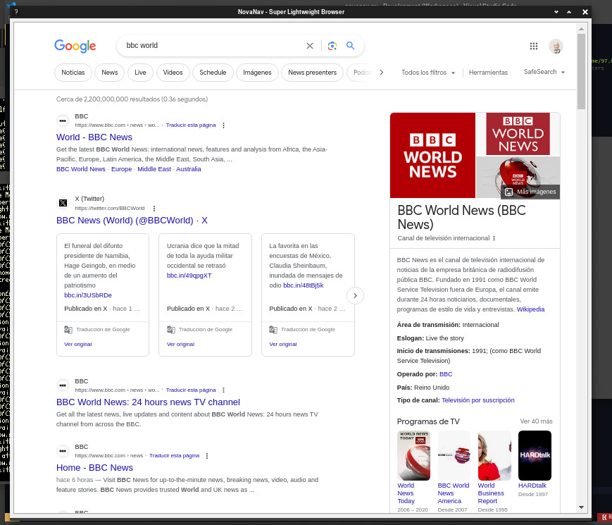

#### NovaNav - Super Lightweight Browser 🌐 

NovaNav: Lightweight browser* for Linux and macOS, delivering fast, distraction-free browsing experience. This is my own version for Arc Browser mostly for Linux.

 

NovaNav, inspired by Arc Browser, is a minimalist and distraction-free web browser developed using PyQt5 and QtWebEngineWidgets. It offers essential browsing functionalities while focusing on simplicity and efficiency. With NovaNav, users can effortlessly navigate the web, open multiple tabs, and adjust zoom settings for optimal viewing.
The browser's clean interface and intuitive design make it ideal for users who prefer a clutter-free browsing experience. By minimizing distractions and prioritizing essential features, NovaNav aims to provide a seamless and enjoyable web browsing experience.

[](https://github.com/felipealfonsog/NovaNav#installation)

<!--
[](https://github.com/felipealfonsog/NovaNav?tab=readme-ov-file#installation)
-->

<sub>* This is currently an experimental phase where the primary focus is on making the system functional and establishing a practical and logical pathway that aligns with both my vision and the project's goals. It might contain errors, bugs, etc. Many other non-core elements of the project are considered secondary.</sub>


[](https://github.com/Naereen/badges/)


[](https://opensource.org/licenses/BSD-3-Clause)

<!--
[](http://perso.crans.org/besson/LICENSE.html)
-->

[](https://www.vim.org/)
[](https://code.visualstudio.com/)


#### Screenshots

[](#)

#### Screenshot Linux

<p align="center">
  
</p>

<p align="center">
  
</p>

#### Screenshot macOS

<p align="center">
  
</p>


#### Installation
#### Via AUR using YAY

[](https://aur.archlinux.org/packages/novanav)

<!-- 
[](https://aur.archlinux.org/packages/novanav)
-->

https://aur.archlinux.org/packages/novanav

NovaNav Browser is available on AUR (Arch User Repository), and it can be installed using the `yay` package manager. Follow the steps below to install NovaNav:

1. Make sure you have `yay` installed. If not, you can install it with the following command:
   
   ```
   sudo pacman -S yay
   ```
   Once yay is installed, you can install by running the following command:
   
   ```
   yay -S novanav
   ```
This command will automatically fetch the package from AUR and handle the installation process for you.


#### Current Features
#### 🚀 Current Features (Some might be in progress)

- Tab Management: Open multiple tabs and switch between them seamlessly.
- URL Navigation: Enter URLs directly or use the search bar to navigate to websites.
- Zoom Control: Adjust zoom settings to customize the display of web pages.
- User-friendly Interface: Clean and intuitive interface for easy navigation and usage.
- Basic Settings: Customize settings such as homepage and default search engine.


#### Download the Binary file (Executable for Linux)


Or just Copy - Paste in your terminal and use -curl- to start downloading the binary file:

   ```
   curl -O https://freeshell.de/~felipe/NovaNav/Bin/novanav_v.0.0.2.tar.gz
   ```

If you want to use -wget- just copy/paste this line:

   ```
   wget https://freeshell.de/~felipe/NovaNav/Bin/novanav_v.0.0.2.tar.gz
   ```
   

   On macOS to download - wget - just install it with Homebrew:

   ```
   brew install wget
   ```

#### Unpack the tarball:

1. **Download the file**: Download the `novanav_v.x.x.x.tar.gz` file from the repository.

2. **Open the terminal**: Open the terminal on your operating system.

3. **Navigate to the file location**: Use the `cd` command to navigate to the folder where you downloaded the `novanav_v.x.x.x.tar.gz` file.

   ```
   cd ./novanav 
   ```
- Unzip the file: Use the following command to unzip the .tar.gz file:

   ```
   tar -xzvf novanav_v.x.x.x.tar.gz
   ```

- Run the application: Once unzipped, you can run the application using the generated executable.

  ```
  ./novanav
  ```
  
- You can install it locally on your system:

 ```
 sudo cp novanav /usr/local/bin/novanav
 ```

Enjoy browsing!: Now you can enjoy NovaNav - Super Lightweight Browser on your system!

#### To force the link and overwrite all conflicting files (Errors)

**If you get this error while you are trying to run the software in the terminal or the software doesn't show up, follow the next steps on macOS or Linux: **

E.g.:

```
felipe@Felipes-MacBook-Air src % python3 novanav.py
Traceback (most recent call last):
  File "/Users/felipe/Documents/Development/NovaNav/src/novanav.py", line 2, in <module>
    from PyQt5.QtCore import QUrl, Qt
ModuleNotFoundError: No module named 'PyQt5'
```

Install or reinstall pyqt5 with the following command in brew:
E.g.:

```
felipe@Felipes-MacBook-Air src % brew install pyqt5
==> Downloading https://formulae.brew.sh/api/formula.jws.json
############################################################################################################ 100.0%
Warning: Formula pyqt5 was renamed to pyqt@5.
==> Downloading https://formulae.brew.sh/api/cask.jws.json
############################################################################################################ 100.0%
Warning: pyqt@5 5.15.10 is already installed, it's just not linked.
To link this version, run:
  brew link pyqt@5
felipe@Felipes-MacBook-Air src % brew link pyqt@5
Linking /usr/local/Cellar/pyqt@5/5.15.10... 
Error: Could not symlink bin/pylupdate5
Target /usr/local/bin/pylupdate5
already exists. You may want to remove it:
  rm '/usr/local/bin/pylupdate5'

To force the link and overwrite all conflicting files:
  brew link --overwrite pyqt@5

To list all files that would be deleted:
  brew link --overwrite pyqt@5 --dry-run

```

**So, if you want to delete all files that will be deleted by `brew link --overwrite`, use the `--dry-run` option
Then run,**

```
rm '/usr/local/bin/pylupdate5'
```

```
brew link --overwrite pyqt@5
```

```
brew link --overwrite pyqt@5 --dry-run
```
The last one will show you what would delete if you proceed. If everything looks good, hit return. Then you should have PyQt5 properly installed.

And then try running your program again.

E.g.:

```
felipe@Felipes-MacBook-Air src % rm '/usr/local/bin/pylupdate5'
felipe@Felipes-MacBook-Air src % brew link --overwrite pyqt@5

Linking /usr/local/Cellar/pyqt@5/5.15.10... 5279 symlinks created.
```

```
felipe@Felipes-MacBook-Air src % python3 novanav.py  
```

Then should be fine with no errors. If you still have problems please let me know.
Also if you want to install `pyrcc5` (which is not necessary but can help) just do a normal installation using pip: I am using Python 3.x.

#### Future Goals
#### 🚀 Future Goals

- Implement support for bookmarks to allow users to save their favorite websites for quick access.
- Enhance tab management features, such as rearranging tabs and grouping them into tab sets.
- Improve compatibility with various web standards and technologies to ensure a seamless browsing experience.
- Introduce customization options for user interface themes and keyboard shortcuts to cater to different user preferences.
- Enhance privacy and security features to protect user data and browsing activities from unauthorized access.


#### Requirements & Instructions for compiling and executing manually.

Install Python3, then:

You might need perhaps to create an enviroment for pip: 
```
python3 -m venv novanav-env
source novanav-env/bin/activate
```

If not, just go with this:

```
pip3 install -r requirements.txt
```

Runt it with: 

```
python3 ./src/novanav.py
```

#### How-to - NovaNav

```
ctrl+t (New tab)
ctrl+v (hide tabs for distraction-free)
ctrl+q (quit)
```

#### 🤝 Support and Contributions

If you find this project helpful and would like to support its development, there are several ways you can contribute:

- **Code Contributions**: If you're a developer, you can contribute by submitting pull requests with bug fixes, new features, or improvements. Feel free to fork the project and create your own branch to work on.
- **Bug Reports and Feedback**: If you encounter any issues or have suggestions for improvement, please open an issue on the project's GitHub repository. Your feedback is valuable in making the project better.
- **Documentation**: Improving the documentation is always appreciated. If you find any gaps or have suggestions to enhance the project's documentation, please let me know.

[](https://www.buymeacoffee.com/felipealfonsog)
[](https://www.paypal.me/felipealfonsog)
[](https://github.com/sponsors/felipealfonsog)

Your support and contributions are greatly appreciated! Thank you for your help in making this project better. If you need to mail me, this is the way: f.alfonso@res-ear.ch (I'm Felipe, the Computer Science Engineer behind this idea. Cheers!)

#### 📄 License

This project is licensed under the [BSD 3-Clause License](LICENSE). It will have some restrictions, ask about it.
